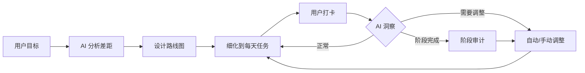

# Career Kit

[](https://opensource.org/licenses/MIT)
[](https://www.python.org/downloads/)
[](https://modelcontextprotocol.io/)

> 别再海投了。AI 帮你规划路线、打卡执行、达成目标。

## 你是不是也这样？

**海投 100 份简历，0 个面试。**
不知道是简历写得不好，还是技能不够，还是投的公司不对。每天打开招聘软件，越看越焦虑。

**想转行，但不知道从哪开始。**
网上教程一堆，今天学 Python，明天学 LLM，后天又看到有人说要学 RAG。到底先学什么？学了有没有用？

**计划做了，执行不下去。**
每次都立 flag，每次都倒。没有人监督，没有反馈，不知道自己是快了还是慢了。慢慢地，连打开计划的勇气都没有了。

**拿到面试了，不知道怎么准备。**
面经一堆，但不知道哪些是重点。准备了一周，面试官问的问题一个都没押中。挂了，也不知道为什么挂。

**迷茫。**
不知道自己值多少钱，不知道市场要什么人，不知道现在学的东西有没有用。每天都在焦虑，但不知道该怎么办。

## Career Kit 怎么帮你？

**有真实数据，不瞎分析**
接入 BOSS 直聘、牛客网，字节跳动，百度，阿里，腾讯等企业官网的真实数据。AI 分析你的差距时，用的是市场真实要求，不是凭空想象。

**细化到每天，跟着做就行**
不只是给你一个大方向。AI 把路线图拆成每天的任务，你只需要看今天做什么、打卡完成。不用想"下一步该干嘛"。

**跟着你调整，不是死计划**
提前完成？加深度任务。超期了？压缩后续时长。拿到面试？自动加面试冲刺阶段。计划跟着你变，不是你跟着计划走。

## 快速开始

```bash
git clone https://github.com/Wuuuuuuuuuz/career-kit.git
cd career-kit
pip install -e .
```

然后在 Claude Code / Cursor / Windsurf 中配置：

```json
{
  "mcpServers": {
    "career-kit": {
      "command": "career-kit"
    }
  }
}
```

和 AI 说"我想转行"，就开始了。

## 它能做什么？

```
你：我想转 AI Agent 方向
Career Kit：分析差距 → 拉取真实岗位数据 → 设计路线图 → 细化到每天任务

你：今天任务完成了
Career Kit：打卡记录 → 提前完成？加深度任务 / 超期？压缩后续时长

你：我拿到大厂面试了
Career Kit：触发洞察 → 调整计划 → 加上面试冲刺阶段
```

## 核心流程



## 为什么选 Career Kit？

| | ChatGPT | 求职网站 | Career Kit |
|---|---------|----------|------------|
| 真实岗位数据 | ❌ | ✅ | ✅ |
| 个性化路线图 | ❌ | ❌ | ✅ |
| 每日任务打卡 | ❌ | ❌ | ✅ |
| 进度追踪调整 | ❌ | ❌ | ✅ |
| 免费 | ✅ | ✅ | ✅ |
| 本地运行，数据不上传 | ✅ | ❌ | ✅ |

## MCP 工具

### 建档与分析

| 工具 | 作用 |
|------|------|
| `start_session` | 初始化新的职业规划会话 |
| `intake` | 逐步填充档案（who/have/want） |
| `finalize_profile` | 确认档案完整，生成摘要，解锁分析工具 |
| `list_company_jobs` | 列出可用企业数据源（BOSS直聘/字节/牛客） |
| `fetch_company_jobs` | 抓取真实岗位（含薪资范围） |
| `fetch_jd_detail` | 获取 JD 全文 |
| `search_knowledge` | 检索本地知识库 |
| `analyze_gaps` | 基于真实数据对比现状与目标 |

### 任务与打卡

| 工具 | 作用 |
|------|------|
| `generate_roadmap` | 基于差距分析生成分阶段路线图 |
| `generate_schedule` | 路线图拆解为日/周日程，支持导出 ICS |
| `get_today_tasks` | 获取今日待办任务 |
| `checkin_task` | 打卡任务（完成/跳过/部分完成） |
| `get_progress` | 获取进度概览 |

### 洞察与调整

| 工具 | 作用 |
|------|------|
| `trigger_insight` | 触发洞察检查（阶段完成/事件触发） |
| `suggest_adjustment` | AI 提出调整建议 |
| `apply_adjustment` | 应用调整（小幅自动，大幅需确认） |

## 文档

- [LLM 使用指南](llms.txt)：工作流、工具分类、常见场景
- [工作流详解](docs/workflow.md)：完整工作流、前置条件、输入输出
- [企业库](docs/scrapers.md)：已收录企业、数据源说明
- [工具总览](docs/tools.md)：MCP 工具列表、分类说明
- [知识库](docs/knowledge.md)：目录结构、文件格式
- [示例](docs/examples/README.md)：完整工作流示例、场景示例

## 隐私

所有数据存储在本地 `~/.career-kit/`，不会发送到任何外部服务器。

## 开源协议

MIT
