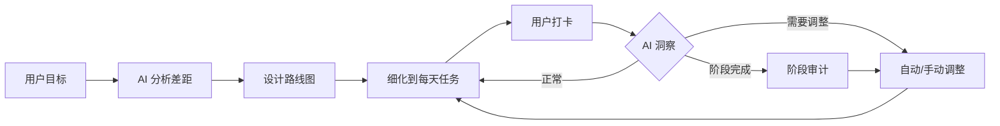

# Career Kit

[](https://opensource.org/licenses/MIT)
[](https://www.python.org/downloads/)
[](https://modelcontextprotocol.io/)

> 别再海投了。AI 帮你规划路线、打卡执行、达成目标。

## 你是不是也这样？

**海投 100 份简历，0 个面试。**
不知道是简历写得不好，还是技能不够，还是投的公司不对。每天打开招聘软件，越看越焦虑。

**想转行，但不知道从哪开始。**
网上教程一堆，今天学 Python，明天学 LLM，后天又看到有人说要学 RAG。到底先学什么？学了有没有用？

**计划做了，执行不下去。**
每次都立 flag，每次都倒。没有人监督，没有反馈，不知道自己是快了还是慢了。慢慢地，连打开计划的勇气都没有了。

**拿到面试了，不知道怎么准备。**
面经一堆，但不知道哪些是重点。准备了一周，面试官问的问题一个都没押中。挂了，也不知道为什么挂。

**迷茫。**
不知道自己值多少钱，不知道市场要什么人，不知道现在学的东西有没有用。每天都在焦虑，但不知道该怎么办。

## Career Kit 怎么帮你？

**有真实数据，不瞎分析**
接入 BOSS 直聘、牛客网，字节跳动，百度，阿里，腾讯等企业官网的真实数据。AI 分析你的差距时，用的是市场真实要求，不是凭空想象。

**拆成阶段任务，跟着做就行**
不只是给你一个大方向。AI 把路线图拆成分阶段任务，随时问「接下来做什么」、打卡完成，不用想"下一步该干嘛"。

**跟着你调整，不是死计划**
完成得轻松？建议加深难度。拿到面试？触发洞察重估计划。换了目标？已完成的进度自动沉淀为能力证据，努力不白费。

## 快速开始

```bash
git clone https://github.com/Wuuuuuuuuuz/career-kit.git
cd career-kit
pip install -e .
```

### 接入你的 AI Agent（一行命令）

> **解释器很重要**：注册命令里的 `python` 必须是执行过 `pip install -e .` 的那一个。
> 本机存在多个 Python 时（系统/msys64/venv），裸 `python` 可能指向缺依赖的解释器。
> 最稳妥写法是 venv 绝对路径，例如：
> `claude mcp add career-kit -- D:\path\to\career-kit\.venv\Scripts\python.exe -m src.server`

| Agent | 注册方式 |
|-------|---------|
| Claude Code | `claude mcp add career-kit -- python -m src.server` |
| Codex CLI | `codex mcp add career-kit -- python -m src.server` |
| opencode | 在项目或全局 `opencode.json` 中加入：`{"mcp": {"career-kit": {"type": "local", "command": ["python", "-m", "src.server"], "enabled": true}}}` |
| Cursor / Windsurf | MCP 设置中手动添加：command=`python`，args=`["-m", "src.server"]` |

> macOS 用户把 `python` 换成 `python3`。项目发布 PyPI 后将支持 `uvx career-kit` 免克隆使用。

### 验证安装

对新会话说「调用 start_session」，或直接敲 `/career-kit`——
收到「欢迎使用 Career Kit」欢迎手册即接入成功。

### 故障排查

| 现象 | 处理 |
|------|------|
| 工具列表里没有 career-kit 的工具 | 确认注册命令在 career-kit 目录下执行；Claude Code 会话内用 `/mcp` 查看连接状态 |
| 服务器启动即崩 / `No module named 'mcp'` | 注册用了错误解释器——改用 venv 绝对路径（见上方警告） |
| 抓取工具报 Playwright 相关错误 | 先执行 `playwright install chromium` 安装浏览器内核 |
| BOSS 直聘提示需要登录 | 在项目目录运行 `python -m src.scrapers.boss.login`，扫码后回车即可 |
| opencode 不加载配置 | opencode 无 cwd 字段，command 数组里同样建议写 venv 绝对路径 |

### 斜杠命令（可选）

- **Claude Code**：仓库已内置 `/career-kit [目标]`——在本目录启动 claude 即可直接使用；
  想在任意目录用，复制到全局：`mkdir -p ~/.claude/commands && cp .claude/commands/career-kit.md ~/.claude/commands/`
- **opencode**：同理内置 `.opencode/commands/career-kit.md`；全局版复制到 `~/.config/opencode/commands/`
- **Codex CLI**：把 `.claude/commands/career-kit.md` 复制为 `~/.codex/prompts/career-kit.md`，
  即可用 `/prompts:career-kit` 调用

和 AI 说"我想转行"，或直接敲 `/career-kit 转行 AI Agent 工程师`。

## 它能做什么？

```
你：我想转 AI Agent 方向
Career Kit：分析差距 → 拉取真实岗位数据 → 设计路线图 → 拆成阶段任务

你：这步做完了
Career Kit：打卡记录 → 完成即沉淀能力证据 → 阶段完成自动触发审计

你：我拿到大厂面试了
Career Kit：事件触发洞察 → 重估计划 → 调整阶段任务
```

## 核心流程



## 为什么选 Career Kit？

| | ChatGPT | 求职网站 | Career Kit |
|---|---------|----------|------------|
| 真实岗位数据 | ❌ | ✅ | ✅ |
| 个性化路线图 | ❌ | ❌ | ✅ |
| 每日任务打卡 | ❌ | ❌ | ✅ |
| 进度追踪调整 | ❌ | ❌ | ✅ |
| 免费 | ✅ | ✅ | ✅ |
| 本地运行，数据不上传 | ✅ | ❌ | ✅ |

## MCP 工具

### 建档与分析

| 工具 | 作用 |
|------|------|
| `start_session` | 初始化新的职业规划会话 |
| `intake` | 逐步填充档案（who/have/want） |
| `finalize_profile` | 确认档案完整，生成摘要，解锁分析工具 |
| `list_data_sources` | 列出可用企业数据源（BOSS直聘/字节/牛客） |
| `fetch_company_jobs` | 抓取真实岗位（含薪资范围） |
| `fetch_jd_detail` | 获取 JD 全文 |
| `search_knowledge` | 检索本地知识库 |
| `analyze_gaps` | 基于真实数据对比现状与目标 |

### 任务与打卡

| 工具 | 作用 |
|------|------|
| `generate_roadmap` | 基于差距分析生成分阶段路线图（只定顺序与标准，无时限） |
| `generate_tasks` | 从路线图生成任务列表 |
| `get_next_tasks` | 当前阶段的下一步任务（关卡式推进） |
| `checkin_task` | 打卡任务，完成自动沉淀能力证据 |
| `get_progress` | 获取进度概览 |

### 洞察与产出

| 工具 | 作用 |
|------|------|
| `trigger_insight` / `apply_insight` | 洞察检查与应用调整（阶段审计/事件触发） |
| `get_workflow_status` | 工作流状态 + 目标变更检测 |
| `export_dashboard` | 生成阶段驱动的自包含 HTML 仪表盘 |

## 文档

- [LLM 使用指南](llms.txt)：工作流、工具分类、常见场景
- [工作流详解](docs/workflow.md)：完整工作流、前置条件、输入输出
- [企业库](docs/scrapers.md)：已收录企业、数据源说明
- [工具总览](docs/tools.md)：MCP 工具列表、分类说明
- [知识库](docs/knowledge.md)：目录结构、文件格式
- [示例](docs/examples/README.md)：完整工作流示例、场景示例

## 隐私

所有数据存储在本地 `~/.career-kit/`，不会发送到任何外部服务器。

## 开源协议

MIT
