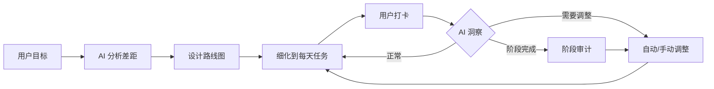

# Career Kit

有真实数据源的 AI 职业陪练。帮你设计最优路线，细化到每天任务，跟着做、打卡，达成目标。

> LLM 使用指南：[llms.txt](llms.txt) — 包含工具说明、工作流程、术语表、对话示例

## 它能做什么

```
你：我想转 AI Agent 方向
Career Kit：分析差距 → 拉取真实岗位数据 → 设计路线图 → 细化到每天任务

你：今天任务完成了
Career Kit：打卡记录 → 提前完成？加深度任务 / 超期？压缩后续时长

你：我拿到大厂面试了
Career Kit：触发洞察 → 调整计划 → 加上面试冲刺阶段
```

## 核心流程



## MCP 工具

### 建档与分析

| 工具 | 作用 |
|------|------|
| `start_session` | 初始化新的职业规划会话 |
| `intake` | 逐步填充档案（who/have/want） |
| `finalize_profile` | 确认档案完整，生成摘要，解锁分析工具 |
| `analyze_gaps` | 对比现状与目标，拉取市场数据 |
| `search_market` | 搜索岗位、薪资、面试信息 |

### 任务与打卡

| 工具 | 作用 |
|------|------|
| `generate_roadmap` | 基于差距分析生成分阶段路线图 |
| `generate_schedule` | 路线图拆解为日/周日程，支持导出 ICS |
| `get_today_tasks` | 获取今日待办任务 |
| `checkin_task` | 打卡任务（完成/跳过/部分完成） |
| `get_progress` | 获取进度概览 |

### 洞察与调整

| 工具 | 作用 |
|------|------|
| `trigger_insight` | 触发洞察检查（阶段完成/事件触发） |
| `suggest_adjustment` | AI 提出调整建议 |
| `apply_adjustment` | 应用调整（小幅自动，大幅需确认） |

## 数据模型

骨架固定，内容自由。LLM 根据每个用户的具体情况决定每个 section 里放什么：

```json
{
  "who": {},     // 你是谁——LLM 自由填充
  "have": {},    // 你有什么——技能、经历、资源
  "want": {},    // 你想要什么——目标岗位、行业、薪资
  "gap": {},     // 差距是什么——analyze_gaps 自动生成
  "plan": {},    // 怎么走——generate_roadmap 自动生成
  "checkins": [],    // 打卡记录
  "adjustments": []  // 调整历史
}
```

只有这 5 个 section 是固定的，内部字段完全由 LLM 根据对话内容灵活组织。`checkins` 和 `adjustments` 用于追踪进度和调整历史。

## 洞察触发机制

AI 在以下情况主动提出调整建议：

| 类型 | 触发时机 | 示例 |
|------|----------|------|
| 阶段审计 | 完成阶段后 | 完成实习后，评估含金量决定是否升级目标 |
| 事件触发 | 用户报告事件 | "拿到大厂面试" → 加上面试冲刺阶段 |
| 主动检查 | 每次对话 | 超期任务 → 压缩后续任务时长 |

## 调整策略

- **小幅调整（自动）**：超期 1-2 天，压缩后续任务各 0.5 天；提前完成，添加深度任务
- **大幅调整（询问用户）**：超期 1 周+，重新规划阶段；目标变更（中厂→大厂），重新设计路线

## 前端

提供静态 HTML 仪表盘（`dashboard.html`），读取 `progress.json` 显示进度：
- 总体进度条
- 当前阶段详情
- 今日任务列表（可勾选）
- 打卡历史
- 调整历史

用户双击 HTML 即可查看，无需启动 agent。

## 安装

### 从 GitHub 克隆

```bash
git clone https://github.com/Wuuuuuuuuuz/career-kit.git
cd career-kit
pip install -e .
```

### 从 PyPI 安装（待发布）

```bash
pip install career-kit
```

## 在 Claude Code 中使用

添加到 MCP 配置：

```json
{
  "mcpServers": {
    "career-kit": {
      "command": "career-kit"
    }
  }
}
```

或者使用本地路径：

```json
{
  "mcpServers": {
    "career-kit": {
      "command": "python",
      "args": ["-m", "src.server"],
      "cwd": "/path/to/career-kit"
    }
  }
}
```

## 在 Cursor / Windsurf / Continue 中使用

Career Kit 使用标准 MCP 协议，任何 MCP 客户端都能连接。

## 文档

- [LLM 使用指南](llms.txt)：工作流、工具分类、常见场景
- [工作流详解](docs/workflow.md)：完整工作流、前置条件、输入输出
- [企业库](docs/scrapers.md)：已收录企业、数据源说明
- [工具总览](docs/tools.md)：MCP 工具列表、分类说明
- [知识库](docs/knowledge.md)：目录结构、文件格式
- [示例](docs/examples/README.md)：完整工作流示例、场景示例

## 隐私

所有数据存储在本地 `~/.career-kit/`，不会发送到任何外部服务器。

## 开源协议

MIT
