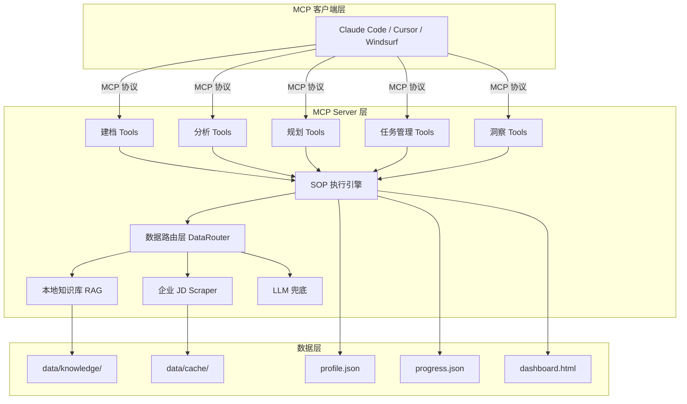
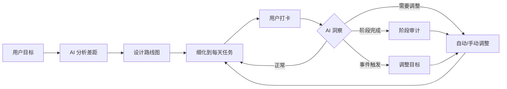

# Career Kit 系统架构设计

> 系统分层、组件职责、数据流、接口规范

---

## 1. 系统定位

**有真实数据源的 AI 职业陪练**

```
传统求职工具：信息聚合（LinkedIn、Boss直聘）→ 只给数据，不给指导
AI 求职助手：ChatGPT → 没有结构化追踪，没有真实数据
职业教练：真人教练 → 贵、不24/7、没有数据支撑

Career Kit：真实数据 + AI 教练 + 进度追踪 = 职业陪练
```

---

## 2. 整体分层



---

## 3. 核心循环（职业教练 Loop）



---

## 4. 数据流

### 4.1 建档阶段

```
用户输入 → start_session → intake(who/have/want) → finalize_profile
```

### 4.2 分析规划阶段

```
analyze_gaps() → DataRouter.search() → 生成路线图 → 细化到任务
```

### 4.3 执行打卡阶段

```
get_today_tasks() → 用户执行 → checkin_task() → 更新进度
```

### 4.4 洞察调整阶段

```
trigger_insight() → 分析进度 → suggest_adjustment() → apply_adjustment()
```

---

## 5. 组件职责

### 5.1 MCP Server 层

| 组件 | 职责 | 文件 |
|------|------|------|
| 建档 Tools | 用户档案管理 | profile.py |
| 分析 Tools | 差距分析 | gap_analyzer.py |
| 规划 Tools | 路线图和日程 | roadmap.py, schedule.py |
| 任务管理 Tools | 任务创建、打卡、调整 | task_manager.py |
| 洞察 Tools | 进度检查、调整建议 | insight.py |
| SOP 执行引擎 | YAML 配置驱动的分析流程 | sop_executor.py |
| 数据路由层 | 按优先级路由搜索请求 | data_source.py |

### 5.2 数据层

| 组件 | 职责 | 路径 |
|------|------|------|
| 知识库 | 用户积累的求职资料 | data/knowledge/ |
| 缓存 | 爬虫抓取结果缓存 | data/cache/ |
| 档案 | 用户职业档案 | ~/.career-kit/profile.json |
| 进度 | 打卡和调整历史 | ~/.career-kit/progress.json |
| 仪表盘 | 静态前端 | data/dashboard.html |

---

## 6. 数据结构

### 6.1 任务 (Task)

```json
{
  "id": "task_001",
  "name": "学习列表推导式",
  "description": "掌握 Python 列表推导式语法",
  "phase_id": "phase_1",
  "milestone_id": "ms_1_1",
  "estimated_days": 2,
  "deadline": "2026-08-27",
  "status": "pending",
  "priority": "high",
  "started_at": null,
  "completed_at": null
}
```

**状态**：pending | in_progress | completed | overdue | skipped

### 6.2 打卡记录 (CheckIn)

```json
{
  "task_id": "task_001",
  "timestamp": "2026-08-26T10:00:00",
  "status": "completed",
  "notes": "提前完成，练习题也做了"
}
```

### 6.3 调整记录 (Adjustment)

```json
{
  "timestamp": "2026-08-26T10:00:00",
  "trigger": "task_001 提前1天完成",
  "trigger_type": "stage_audit",
  "reason": "用户学习速度快，可以加深难度",
  "changes": [
    {
      "type": "add_task",
      "task": {
        "id": "task_001b",
        "name": "列表推导式性能优化",
        "estimated_days": 1
      }
    }
  ],
  "approved": true
}
```

---

## 7. 洞察触发机制

### 7.1 三种触发方式

| 类型 | 触发时机 | 示例 |
|------|----------|------|
| 阶段审计 | 完成阶段后 | 完成实习后，评估含金量决定是否升级目标 |
| 事件触发 | 用户报告事件 | "拿到大厂面试" → 加上面试冲刺阶段 |
| 主动检查 | 每次对话 | 超期任务 → 压缩后续任务时长 |

### 7.2 运行时指令

注入到 system prompt：
```
你是一个职业教练。当发现以下情况时，主动向用户提出调整建议：
1. 用户完成阶段后 → 触发阶段审计，评估是否需要调整后续计划
2. 用户提到面试机会 → 评估目标调整
3. 用户提到困难 → 调整难度或提供支持
4. 任务超期 → 压缩后续任务时长
```

---

## 8. 调整策略

### 8.1 小幅调整（自动）

- 超期 1-2 天：压缩后续任务各 0.5 天
- 提前完成：添加深度任务或开始下一个任务

### 8.2 大幅调整（询问用户）

- 超期 1 周+：重新规划阶段
- 目标变更（中厂→大厂）：重新设计路线

---

## 9. 前端设计

### 9.1 静态 HTML 仪表盘

- 总体进度条
- 当前阶段详情
- 今日任务列表（可勾选）
- 打卡历史
- 调整历史

### 9.2 数据流

```
profile.json + progress.json → dashboard.html → 用户查看
```

---

## 10. 企业库框架

### 10.1 接口规范

```python
class CompanyScraper(ABC):
    @abstractmethod
    def search(self, **kwargs) -> list[dict]:
        """搜索岗位"""
    
    @abstractmethod
    def get_detail(self, url) -> dict:
        """获取岗位详情"""
```

### 10.2 数据流

```
抓取 → 缓存 → 结构化 → 写入知识库 → 检索可用
```

---

*最后更新：2026-08-25*
│      ├─→ 读取路线图                                       │
│      ├─→ 加载 schedule SOP                               │
│      └─→ 返回日程生成任务                                 │
└───────────────────────────┬──────────────────────────────┘
                            │
                            ▼
┌──────────────────────────────────────────────────────────┐
│                    追踪阶段                               │
│                                                          │
│  track_progress(report)                                  │
│      ├─→ 读取当前路线图                                   │
│      ├─→ 对比进度偏差                                     │
│      └─→ 返回分析任务                                     │
│                                                          │
│  ──→ 循环回到 analyze_gaps (重新评估)                     │
└───────────────────────────┬──────────────────────────────┘
                            │
                            ▼
┌──────────────────────────────────────────────────────────┐
│                    反馈循环（闭环）                        │
│                                                          │
│  用户沟通中                                               │
│      │                                                   │
│      ├─→ 用户主动："记住这个" → save_feedback()           │
│      │                                                   │
│      ├─→ 系统检测关键信息 → 询问"要持久化吗？"            │
│      │                                                   │
│      └─→ 对话结束 → 自动生成摘要 → 询问"保存吗？"         │
│                                                          │
│  反馈写入 dev/knowledge/feedback/                         │
│      │                                                   │
│      └─→ 下次分析时检索，调整分析策略                     │
└──────────────────────────────────────────────────────────┘
```

---

## 3. 核心组件职责

### 3.1 MCP Server 层

| 组件 | 职责 | 文件 |
|------|------|------|
| `server.py` | MCP tool 注册和路由 | `src/server.py` |
| Tools | 具体工具实现 | `src/tools/*.py` |
| SOP Engine | YAML 配置驱动的分析流程 | `src/tools/sop_executor.py` |

### 3.2 数据路由层

| 组件 | 职责 | 文件 |
|------|------|------|
| `DataRouter` | 按优先级路由搜索请求 | `src/tools/data_source.py` |
| `LocalKnowledgeSource` | 本地知识库检索 | `src/tools/data_source.py` |
| `ScraperSource` | 企业爬虫数据源 | `src/tools/data_source.py` |
| `LLMKnowledgeSource` | LLM 知识兜底 | `src/tools/data_source.py` |

### 3.3 企业库框架

| 组件 | 职责 | 文件 |
|------|------|------|
| `CompanyScraper` | 爬虫接口定义 | `src/scrapers/base.py` |
| `loader.py` | 动态加载和注册 | `src/scrapers/loader.py` |
| `knowledge_writer.py` | 数据自动写入知识库 | `src/scrapers/knowledge_writer.py` |
| `config.yaml` | 爬虫注册配置 | `src/scrapers/config.yaml` |

### 3.4 数据层

| 组件 | 职责 | 路径 |
|------|------|------|
| 知识库 | 用户积累的求职资料 | `dev/knowledge/` |
| 缓存 | 爬虫抓取结果缓存 | `src/scrapers/*/cache/` |
| 档案 | 用户职业档案 | `~/.career-kit/profile.json` |

---

## 4. 接口规范

### 4.1 企业爬虫接口

```python
# src/scrapers/base.py

class CompanyScraper(ABC):
    """企业 JD 数据源抽象基类。"""
    
    @abstractmethod
    def search(self, **kwargs: Any) -> list[dict[str, Any]]:
        """搜索岗位。
        
        Args:
            **kwargs: 搜索参数，由各实现自定义
                常见参数：keyword, city, job_type, limit
        
        Returns:
            岗位列表，每项必须包含：
            {
                "title": "岗位名称",        # 必填
                "url": "岗位链接",          # 必填
                "company": "公司名称",      # 必填
                "location": "工作地点",     # 建议
                "summary": "岗位摘要",      # 建议
            }
        """
    
    @abstractmethod
    def get_detail(self, url: str) -> dict[str, Any]:
        """获取岗位详情。
        
        Args:
            url: 岗位详情页 URL
        
        Returns:
            岗位详情 dict，建议包含：
            {
                "title": "岗位名称",
                "company": "公司名称",
                "location": "工作地点",
                "salary": "薪资范围",
                "description": "岗位描述全文",
                "requirements": "任职要求全文",
            }
        """
```

**设计原则**：
- 只定义接口，不提供通用模板
- 每个网站独立实现，千人千面
- 接口规范清晰，实现自由度高

### 4.2 数据源接口

```python
# src/tools/data_source.py

class DataSource(ABC):
    """数据源抽象接口。"""
    
    @abstractmethod
    def search(self, query: str, search_type: str, paths: list[str] | None = None) -> list[dict[str, Any]]:
        """搜索数据。
        
        Args:
            query: 搜索查询
            search_type: 搜索类型（similar_profiles / job_requirements / interview_experiences / market_trends）
            paths: 本地搜索路径（相对于 knowledge/ 目录）
        
        Returns:
            搜索结果列表，每项包含：
            {
                "source": "来源",
                "content": "内容",
                "relevance": "相关度",
            }
        """
```

### 4.3 数据路由优先级

```
DataRouter 搜索优先级：
1. 本地知识库（用户积累的面经/JD/参考简历）
2. 企业 Scraper（实时获取真实 JD 数据）
3. LLM 知识（兜底）
```

---

## 5. 数据格式规范

### 5.1 知识库目录结构

```
dev/knowledge/
├── jds/                          # 岗位描述
│   ├── bytedance/
│   │   ├── 2026-08-21_ai-agent_北京.json
│   │   └── 2026-08-21_frontend_上海.json
│   └── tencent/
│       └── 2026-08-21_backend_深圳.json
│
├── interviews/                   # 面经
│   ├── nowcoder/
│   │   ├── 字节_ai-agent_一面_2026-08.md
│   │   └── 腾讯_后端_二面_2026-07.md
│   └── xiaohongshu/
│       └── 字节_前端_面经_2026-08.md
│
├── resumes/                      # 参考简历
│   ├── 双非转ai_成功案例.md
│   └── 211前端_字节offer.md
│
├── market/                       # 市场数据
│   ├── ai岗位薪资_2026.json
│   └── agent技能图谱.md
│
└── feedback/                     # 用户反馈
    ├── outcomes/                 # 最终结果
    ├── analysis_feedback/        # 分析反馈
    ├── plan_feedback/            # 规划反馈
    └── decisions/                # 关键决策
```

### 5.2 JD 格式 (`jds/`)

```json
{
  "source": "bytedance",
  "url": "https://jobs.bytedance.com/experienced/position/12345/detail",
  "fetched_at": "2026-08-21T10:30:00",
  "title": "AI Agent 开发工程师",
  "company": "字节跳动",
  "location": "北京",
  "salary": "",
  "description": "...",
  "requirements": "...",
  "category": "研发",
  "tags": ["AI", "Agent", "Python"]
}
```

### 5.3 面经格式 (`interviews/`)

```markdown
---
source: nowcoder
url: https://www.nowcoder.com/discuss/12345
company: 字节跳动
position: AI Agent 开发
round: 一面
date: 2026-08-20
tags: [AI, Agent, 系统设计]
---

## 面试过程

...

## 面试题目

1. ...
2. ...
```

### 5.4 反馈格式 (`feedback/`)

```markdown
---
type: feedback
category: analysis_accuracy
timestamp: 2026-08-21T10:30:00
source: user_initiated
profile_version: 42
gap_analysis_version: 5
---

## 反馈内容

你说我缺系统设计，但面试没问。反而问了很多项目细节。

## 影响

下次分析时降低系统设计权重，提高项目深挖权重。
```

---

## 6. 反馈循环机制

### 6.1 核心理念

**半自动持久化**：用户主动 + 自动检测 + 询问确认

```
用户沟通中
    │
    ├─→ 用户主动说"记住这个" → save_feedback()
    │
    ├─→ 系统检测到关键信息 → 询问用户"要持久化吗？"
    │
    └─→ 对话结束 → 自动生成摘要 → 询问用户"保存吗？"
```

### 6.2 反馈类别

| 类别 | 说明 | 示例 |
|------|------|------|
| `analysis_accuracy` | 分析准不准 | "你说我缺系统设计，但面试没问" |
| `plan_effectiveness` | 规划有没有用 | "按计划学了两周，感觉进度太慢" |
| `outcome` | 最终结果 | "拿到字节 offer 了" / "二面挂了" |
| `decision` | 关键决策 | "决定放弃算法岗，转投开发" |

### 6.3 反馈如何影响系统

```
下次分析时
    │
    ├─→ 检索历史反馈（同类型、同岗位）
    │
    ├─→ 注入分析上下文
    │   "上次用户反馈系统设计没问，这次降低权重"
    │
    └─→ 输出调整后的分析
```

### 6.4 MCP Tools 扩展

| 工具 | 作用 | 触发方式 |
|------|------|----------|
| `save_feedback` | 保存用户反馈 | 用户主动 |
| `view_feedback` | 查看历史反馈 | 用户主动 |
| `auto_detect_feedback` | 检测对话中的关键信息 | 自动 |

---

## 7. 数据积累机制

### 7.1 核心理念

**数据积累是双向的**：
- **外部数据**：抓取 → 缓存 → 写入知识库
- **内部数据**：用户反馈 → 持久化 → 影响分析

```
外部数据流：
抓取 → 缓存 → 结构化 → 写入知识库 → 检索可用

内部数据流：
用户反馈 → 持久化 → 写入反馈库 → 影响下次分析
```

### 7.2 框架提供的基础设施

框架自动处理以下事情，贡献者无需关心：

| 功能 | 说明 | 实现位置 |
|------|------|----------|
| 缓存 | 搜索结果 1 小时，详情 24 小时 | `base.py` 缓存方法 |
| 数据积累 | 自动写入 `dev/knowledge/jds/{company}/` | `knowledge_writer.py` |
| 错误处理 | 统一的异常捕获和日志 | `loader.py` |
| 配置加载 | 从 `config.yaml` 读取注册信息 | `loader.py` |
| MCP 集成 | 自动注册为 MCP tool | `server.py` |

---

*最后更新：2026-08-21*
