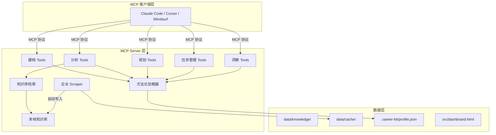
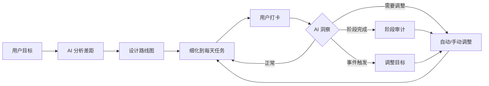

# Career Kit 系统架构设计

> 系统分层、组件职责、数据流、接口规范

---

## 1. 系统定位

**有真实数据源的 AI 职业陪练**

```
传统求职工具：信息聚合（LinkedIn、Boss直聘）→ 只给数据，不给指导
AI 求职助手：ChatGPT → 没有结构化追踪，没有真实数据
职业教练：真人教练 → 贵、不24/7、没有数据支撑

Career Kit：真实数据 + AI 教练 + 进度追踪 = 职业陪练
```

---

## 2. 整体分层



---

## 3. 核心循环（职业教练 Loop）



---

## 4. 数据流

### 4.1 建档阶段

```
用户输入 → start_session → intake(who/have/want) → finalize_profile
```

### 4.2 分析规划阶段

```
list_data_sources → fetch_company_jobs → fetch_jd_detail
    ↓ (真实数据)
analyze_gaps() → save_gap_analysis → generate_roadmap → 细化到任务
```

### 4.3 执行打卡阶段

```
get_today_tasks() → 用户执行 → checkin_task() → 更新进度
```

### 4.4 洞察调整阶段

```
trigger_insight() → 分析进度 → apply_insight() → 应用调整
```

---

## 5. 组件职责

### 5.1 MCP Server 层

| 组件 | 职责 | 文件 |
|------|------|------|
| 建档 Tools | 用户档案管理 | profile.py, session.py |
| 分析 Tools | 差距分析 | gap_analyzer.py |
| 规划 Tools | 路线图和日程 | roadmap.py, schedule.py |
| 任务管理 Tools | 任务创建、打卡、调整 | task_manager.py |
| 洞察 Tools | 进度检查、调整建议 | insight.py |
| 知识库检索 | 本地资料搜索（不联网） | knowledge_search.py |
| 方法论加载器 | YAML 配置驱动的分析指引 | methodology.py |

### 5.2 数据层

| 组件 | 职责 | 路径 |
|------|------|------|
| 知识库 | scraper 自动写入 + 用户积累的求职资料 | data/knowledge/ |
| 缓存 | 爬虫抓取结果缓存 | data/cache/ |
| 档案 | 用户职业档案（含 tasks/checkins/adjustments） | ~/.career-kit/profile.json |
| 仪表盘 | 静态前端 | src/dashboard.html |

---

## 6. 数据结构

### 6.1 任务 (Task)

```json
{
  "id": "task_001",
  "name": "学习列表推导式",
  "description": "掌握 Python 列表推导式语法",
  "phase_id": "phase_1",
  "milestone_id": "ms_1_1",
  "estimated_days": 2,
  "deadline": "2026-08-27",
  "status": "pending",
  "priority": "high",
  "started_at": null,
  "completed_at": null
}
```

**状态**：pending | in_progress | completed | overdue | skipped

### 6.2 打卡记录 (CheckIn)

```json
{
  "task_id": "task_001",
  "timestamp": "2026-08-26T10:00:00",
  "status": "completed",
  "notes": "提前完成，练习题也做了"
}
```

### 6.3 调整记录 (Adjustment)

```json
{
  "timestamp": "2026-08-26T10:00:00",
  "trigger": "task_001 提前1天完成",
  "trigger_type": "stage_audit",
  "reason": "用户学习速度快，可以加深难度",
  "changes": [
    {
      "type": "add_task",
      "task": {
        "id": "task_001b",
        "name": "列表推导式性能优化",
        "estimated_days": 1
      }
    }
  ],
  "approved": true
}
```

---

## 7. 洞察触发机制

### 7.1 三种触发方式

| 类型 | 触发时机 | 示例 |
|------|----------|------|
| 阶段审计 | 完成阶段后 | 完成实习后，评估含金量决定是否升级目标 |
| 事件触发 | 用户报告事件 | "拿到大厂面试" → 加上面试冲刺阶段 |
| 主动检查 | 每次对话 | 超期任务 → 压缩后续任务时长 |

### 7.2 运行时指令

注入到 system prompt：
```
你是一个职业教练。当发现以下情况时，主动向用户提出调整建议：
1. 用户完成阶段后 → 触发阶段审计，评估是否需要调整后续计划
2. 用户提到面试机会 → 评估目标调整
3. 用户提到困难 → 调整难度或提供支持
4. 任务超期 → 压缩后续任务时长
```

---

## 8. 调整策略

### 8.1 小幅调整（自动）

- 超期 1-2 天：压缩后续任务各 0.5 天
- 提前完成：添加深度任务或开始下一个任务

### 8.2 大幅调整（询问用户）

- 超期 1 周+：重新规划阶段
- 目标变更（中厂→大厂）：重新设计路线

---

## 9. 前端设计

### 9.1 静态 HTML 仪表盘

- 总体进度条
- 当前阶段详情
- 今日任务列表（可勾选）
- 打卡历史
- 调整历史

### 9.2 数据流

```
profile.json（tasks/checkins/adjustments 字段）→ dashboard.html → 用户查看
```

---

## 10. 企业库框架

### 10.1 接口规范

```python
class CompanyScraper(ABC):
    @abstractmethod
    def search(self, **kwargs) -> list[dict]:
        """搜索岗位"""
    
    @abstractmethod
    def get_detail(self, url) -> dict:
        """获取岗位详情"""
```

### 10.2 数据流

```
抓取 → 缓存 → 结构化 → 写入知识库 → 检索可用
```

---

*最后更新：2026-08-25*
