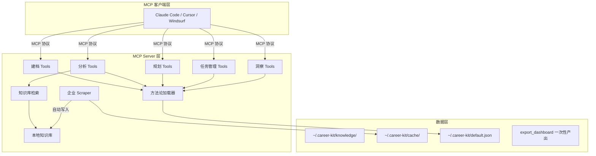
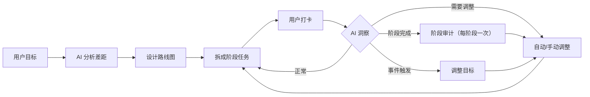

# Career Kit 系统架构设计

> 系统分层、组件职责、数据流、接口规范

---

## 1. 系统定位

**有真实数据源的 AI 职业陪练**

```
传统求职工具：信息聚合（LinkedIn、Boss直聘）→ 只给数据，不给指导
AI 求职助手：ChatGPT → 没有结构化追踪，没有真实数据
职业教练：真人教练 → 贵、不24/7、没有数据支撑

Career Kit：真实数据 + AI 教练 + 进度追踪 = 职业陪练
```

核心理念：**顺序归产品，时间归用户**——不为任务设定时限，进度以阶段为刻度。

---

## 2. 整体分层



---

## 3. 核心循环（职业教练 Loop）



---

## 4. 数据流

### 4.1 建档阶段

```
用户输入 → start_session → intake(who/have/want，技能带证据) → finalize_profile
```

### 4.2 分析规划阶段

```
list_data_sources → fetch_company_jobs → fetch_jd_detail
    ↓ (真实数据)
analyze_gaps() → save_gap_analysis → generate_roadmap → save_roadmap → generate_tasks
```

### 4.3 执行打卡阶段

```
get_next_tasks() → 用户执行 → checkin_task() → 能力证据沉淀 → 更新进度
```

### 4.4 洞察调整阶段

```
trigger_insight(stage_audit/event) → LLM 分析 → apply_insight() → 应用调整
```

### 4.5 产出物

```
export_dashboard() → 自包含 HTML 仪表盘（内嵌数据快照）
日程需求 → LLM 对话中直接写 markdown/HTML 文档，系统不存储
```

---

## 5. 组件职责

### 5.1 MCP Server 层

| 组件 | 职责 | 文件 |
|------|------|------|
| 建档 Tools | 用户档案管理 | profile.py, session.py |
| 分析 Tools | 差距分析报告格式化 | gap_analyzer.py |
| 规划 Tools | 路线图解析与格式化 | roadmap.py |
| 任务管理 Tools | 任务创建、打卡、阶段视图、能力证据沉淀 | task_manager.py |
| 洞察 Tools | 阶段审计、事件洞察、调整应用 | insight.py |
| 知识库检索 | 本地资料搜索（不联网） | knowledge_search.py |
| 方法论加载器 | YAML 配置驱动的分析指引 | methodology.py |

### 5.2 数据层

| 组件 | 职责 | 路径 |
|------|------|------|
| 知识库 | scraper 自动写入 + 用户积累的求职资料（用户自有资产） | ~/.career-kit/knowledge/ |
| 缓存 | 爬虫抓取结果缓存与登录态 | ~/.career-kit/cache/ |
| 档案 | 用户职业档案（含 tasks/checkins/adjustments/capability_evidence） | ~/.career-kit/default.json |
| 仪表盘 | export_dashboard 一次性生成的自包含 HTML | 临时目录，双击即看 |

> 数据根目录统一定义在 `src/paths.py`，环境变量 `CAREER_KIT_DATA_DIR` 可覆盖（测试/CI 用）。

---

## 6. 数据结构

### 6.1 任务 (Task)

产品不规划时间：任务没有 deadline 和预估天数，只有顺序和状态。

```json
{
  "id": "task_001",
  "name": "学习列表推导式",
  "description": "掌握 Python 列表推导式语法",
  "phase_id": "phase_1",
  "milestone_id": "phase_1_ms_1",
  "status": "pending",
  "priority": "high",
  "started_at": null,
  "completed_at": null
}
```

**状态**：pending | in_progress | completed | skipped
**进度刻度**：各阶段 完成数/总数；「超期」概念不存在。

### 6.2 打卡记录 (CheckIn)

```json
{
  "task_id": "task_001",
  "timestamp": "2026-08-26T10:00:00",
  "status": "completed",
  "notes": "练习题也做了"
}
```

完成任务时自动沉淀能力证据到 `have.capability_evidence`：

```json
{
  "task": "学习列表推导式",
  "milestone": "phase_1_ms_1",
  "completed_at": "2026-08-26T10:00:00",
  "notes": "练习题也做了"
}
```

### 6.3 调整记录 (Adjustment)

```json
{
  "timestamp": "2026-08-26T10:00:00",
  "trigger": "完成 LangChain 基础阶段",
  "trigger_type": "stage_audit",
  "reason": "用户掌握速度快，可以加深难度",
  "changes": [
    {
      "type": "add_task",
      "task_id": "task_011",
      "task_name": "列表推导式性能优化"
    }
  ],
  "approved": true
}
```

调整类型仅支持 add_task / remove_task / modify_task——不存在压缩时长类调整。

### 6.4 路线图阶段（jd 三件套）

```json
{
  "type": "intern",
  "name": "某公司 Agent 实习",
  "company": "某公司",
  "rationale": "对双非友好，Agent 布局重",
  "jd": null,
  "jd_status": "pending_user_import",
  "confirmed": false,
  "milestones": []
}
```

知识光谱纪律：company/rationale 是公开常识可自由写；jd 是时效事实，有真实数据（抓取/导入）才填，
否则保持空并标记 pending_user_import（用户确认后 confirmed=true）。`gap.start_level`
（差距分析产出）是 intern/过渡阶段的起点约束，目标超起点时插入过渡阶段。
`export_dashboard(mode="roadmap")` 输出职业地图（路线图+执行进度+占位/依据徽标），
save_roadmap 定稿时自动生成一份。

---

## 7. 洞察触发机制

### 7.1 两种触发方式

| 类型 | 触发时机 | 示例 |
|------|----------|------|
| 阶段审计 stage_audit | 完成阶段后（每阶段只触发一次） | 完成实习后，评估含金量决定是否升级目标 |
| 事件触发 event | 用户报告事件 | "拿到大厂面试" → 加上面试冲刺阶段 |

> 「主动检查/超期压缩」已随时间概念退场而移除：产品不为任务设定时限，不存在超期。
> 目标变更检测：want/target_jd 在路线图保存后被更新时，get_workflow_status 提示重新 analyze_gaps。

---

## 8. 调整策略

### 8.1 小幅调整（对话中决定）

- 打卡返回值提示 LLM：完成得轻松可加深难度或推进下一项，由用户决定（不自动繁殖任务）

### 8.2 大幅调整（询问用户）

- 某类任务反复跳过：调整内容或顺序
- 目标变更（中厂→大厂）：重新 analyze_gaps，已完成进度沉淀为能力证据参与新分析

---

## 9. 产出物

### 9.1 阶段驱动仪表盘（export_dashboard）

一次性产出自包含 HTML（内嵌数据快照，双击即看）：

- 总体进度条 + 各阶段进度条
- 当前阶段的下一步任务
- 能力证据（来自打卡沉淀）
- 调整历史

### 9.2 日程表（对话中直接产出）

用户想要日程时，LLM 在对话中把任务写成 markdown/HTML 文档交付，
时间由用户自己填。系统不存储日程，不维护日程工具链。

---

## 10. 企业库框架

### 10.1 接口规范

```python
class CompanyScraper(ABC):
    @abstractmethod
    def search(self, **kwargs) -> list[dict]:
        """搜索岗位"""
    
    @abstractmethod
    def get_detail(self, url) -> dict:
        """获取岗位详情"""
```

### 10.2 数据流

```
抓取 → 缓存 → 结构化 → 写入知识库 → 检索可用
```

---

*最后更新：2026-08-26*
